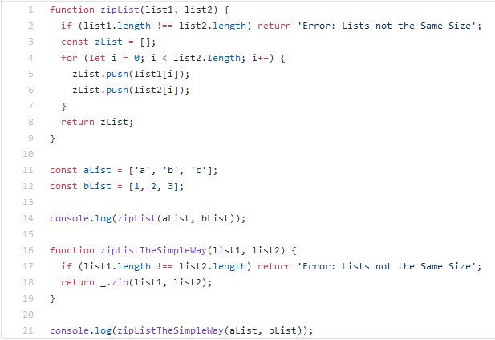

## Introduction
Coding standards: a concept that can appear to some as a valuable and necessary component of software engineering and to others as a tedious process that can be overlooked in most cases. I agree with the notion that coding standards are very important to learn and uphold in any software-related field, but I hate to admit that in practice, I have a tendency to treat coding standards as a nuisance and often find myself ignoring coding standards in order to theoretically maximize my time and get as much of the code done as possible. The rest of this essay will explain how coding standards are not only important, but also how upholding coding standards will be able to maximize time in the long run better than just freely writing out code, and the essay will also cover my personal use of the IntelliJ IDE plugin ESLint, which is able to uphold a coding standards on the code that is being worked on in real time.

## Importance of Coding Standards
Coding standards are essential to any software-related project, and it is capable of saving an abundant amount of time working on the project because it allows the code to be organized in a way that is easier to read and easier to follow. Just like how adding comments throughout your code enables another person to be able to understand what the code is doing and how it is doing it, upholding coding standards allows another person to be able to quickly scan through the code and know where the functions are and what exactly are contained in those functions. For example, while some, including myself, find it tedious to have to properly indent the contents of a function, having no indents throughout the code would make it very difficult to find out where one "for" loop ends and an "if" statement begins.

## ESLint
ESLint is an available plugin for the IntelliJ IDEA IDE that upholds coding standards by including errors and warnings that are triggered due to instances of incorrect indentation, incorrect close-curly-brace placement, etc. Initially, I found it difficult to be able to code with ESLint enabled because it would constantly find errors that I have always assumed was a perfectly fine way to implement that line of code. Over time, however, I have been getting more comfortable with ESLint, and I am very happy with how organized and readable my code has become due to using this plugin.
