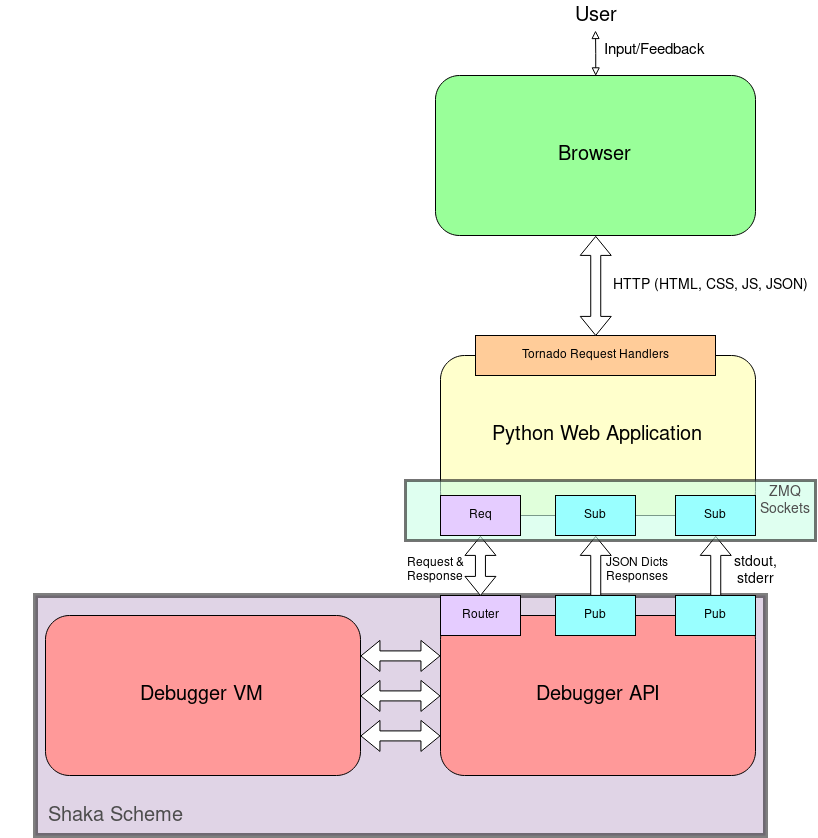

## Patterns, Patterns Everywhere
I remember a time (err... multiple times) where I would be playing a video game and having a very difficult time beating one of the bosses. I would be able to dodge one of their attacks, only to be killed by the following attack. Eventually, through a lot of trial and error, I would be able to find a pattern in their attacks, and I would be able to appropriately respond to that pattern until either the boss changes the attack pattern or I finally defeat the boss. 
While there are explicit areas where we find patterns - such as in video game boss battles - patterns can be found in a lot more areas of our lives than we think, and one area of my life that I never knew had so many patterns to it was in programming. While I was aware of things such as algorithms, I was not aware of the different types of general design patterns that could be used to implement those algorithms (or at least I was unaware that these patterns had names to them). The remainder of this essay will cover two design patterns that were prominent in my programming experience (even though I have been completely unaware of them): the Factory design pattern and the Model-View-Controller design pattern.

## Factory Design Pattern

## Model-View-Controller Design Pattern
