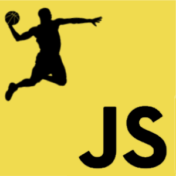

## Introduction

Throughout the first two weeks of the course "ICS 314: Introduction to Software Engineering," the class has been quickly going through the basics of the programming language Javascript through a pedagogy known as "Athletic Software Engineering (ASE)." This essay describes my experience learning Javascript both before and during this course, and it also briefly describes what ASE is, how ASE is implemented in ICS 314, and what my personal opinions are regarding this style of learning. 

## Javascript

Before taking ICS 314, I have encountered Javascript on two separate occasions: one of the former jobs I had at the University of Hawaii at Manoa, and in one of the technical elective engineering courses I took in my 4th year of college; however, ICS 314 is where I actually started learning Javascript. In my former job at UH Manoa, I was a "student programmer" working for the UH IT department. My main task was to convert the metadata spreadsheets from a multiple-page application to a single-page application. At the time of my employment, I was only in my 2nd year of college, and my only experience with programming was a little bit of C and even less of C++. Being asked to work on already-established Javascript code with so little experience programming in general was a bit of an overwhelming introduction to Javascript. The second encounter with Javascript was in the course "EE 491E: Internet of Things" during the spring semester of my 4th year of college. With a lot more programming experience under my belt, and since this version of Javascript ("Nodejs") was a lot more visual based than code based, I had a much easier time making applications in Javascript.

As of right now, I am able to get a much better grasp on Javascript due to my knowledge of other programming languages such as C++ and Python and to the quick and easy tasks provided in ICS 314. My prior programming experience allows me to be able to catch on to any similar code architecture that Javascript has with C++ and/or Python, and the tasks provided in ICS 314 allow me to get familiar with the unique aspects of Javascript much more easily.

## Athletic Software Engineering (ASE)

I enjoy the implementation of "Athletic Software Engineering" to the learning of Javascript because it allows me to gain familiarity with Javascript quickly without overwhelming me with too much work. I also appreciate how the WODs (Workouts of the Day) provide an environment that is not only useful for Javascript programming, but for programming in general.

